# Fylorra

**File intake automation for Windows, macOS, and Linux**

Fylorra watches the folders where files arrive, then routes, renames, links, transfers, converts, archives, and reports on them with safe local automation. The product focus is simple: make Downloads, scanners, cameras, cloud sync folders, and work drop zones stay organized without users babysitting files.

The app still contains useful tools, but the core experience should be one workflow: **intake a file, decide what it is, take a reversible action, and leave an audit trail.**

---

## ✨ Key Features

### 🖥️ **Modern Qt Desktop App**
- Cross-platform Qt interface for Windows, macOS, and Linux
- Dark/light theme support
- Clean navigation for monitoring, links, transfers, AI tools, cloud sync, file tools, and settings

### 🔔 **Windows Native Notifications**
- **Real-time toast notifications** for file events (create, modify, delete, move)
- Windows 10/11 native notification system integration
- Customizable notification settings

### 📁 **File Intake Monitoring**
- Monitor **unlimited folders** simultaneously
- **Recursive subfolder** monitoring
- **Network folder support** (UNC paths: `\\server\share`)
- **FTP/FTPS server monitoring** with polling
- Individual start/stop control for each monitor

### 🤖 **Safe Automation Engine**
7 automation actions available:

1. **Copy** - Copy files to destination folders
2. **Move** - Move files automatically
3. **Rename** - Rename files with patterns (date, time, custom)
4. **Archive** - Create ZIP archives automatically
5. **Organize** - Auto-organize by extension, date, or file type
6. **Delete** - Safe deletion with recycle bin support
7. **Execute** - Run custom commands/scripts

Safety defaults are conservative: duplicate copy/move targets are preserved by renaming unless overwrite is explicitly requested, generated filenames are sanitized, and dangerous cleanup roots are refused.

### ⚡ **Modern Multi-threaded Architecture**
- **Zero lag or freezing** - all operations run in background threads
- Responsive UI at all times
- Handles high-frequency file events efficiently

### 🎨 **Modern 2025 UI**
- Clean, professional interface built with Qt/PySide6
- Dark/Light theme support
- Smooth animations and modern design
- Real-time activity dashboard

### 🔄 **System Tray Integration**
- Minimize to Windows system tray
- Run silently in background
- Quick access from tray icon

### ☁️ **Cloud Sync (MVP)**
- Connect **OneDrive** and **Google Drive** (OAuth)
- Test connection + list cloud root
- Upload/download files (initial foundation for full sync)
- Setup guide: `docs/CLOUD_SYNC.md`

### 🔁 **Device Transfer**
- Send files/folders directly between two trusted Fylorra devices
- LAN device discovery plus manual address/port/code connection
- Works over local networks, VPNs, private tunnels, or port-forwarded remote addresses
- Receiver access code is required for every upload and is never broadcast
- Setup guide: `docs/DEVICE_TRANSFER.md`

### 💾 **Persistent Configuration & Logging**
- All settings and monitors saved automatically
- Resume monitoring on app restart
- Comprehensive activity logging (console + file)
- Export logs in JSON, CSV, or Text format
- Initial folder scan logs all existing files
- Every event logged with timestamp and details

---

## Screenshots

These screenshots are captured from the real Qt desktop app using sanitized sample data.

### Monitors
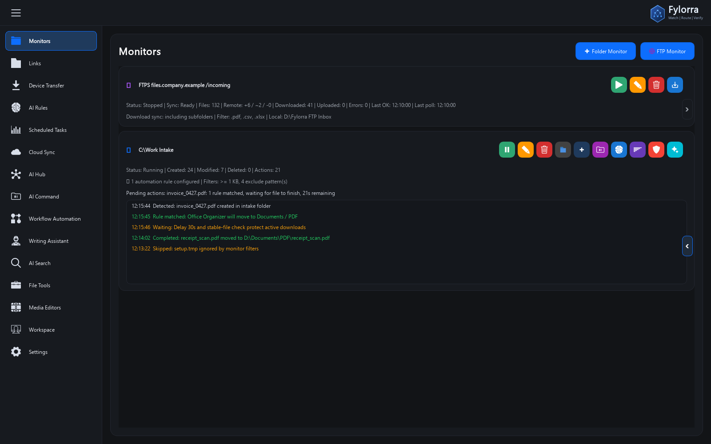

### Symbolic Links
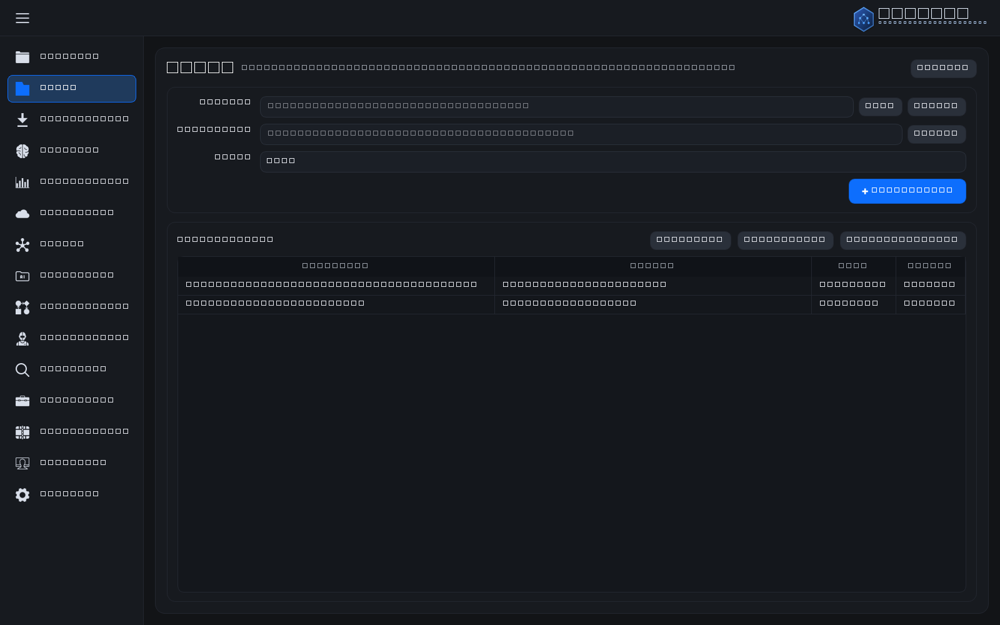

### Device Transfer
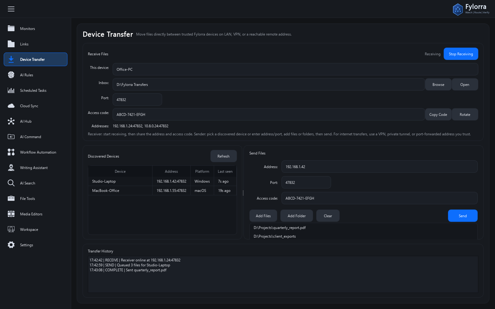

### AI Rules
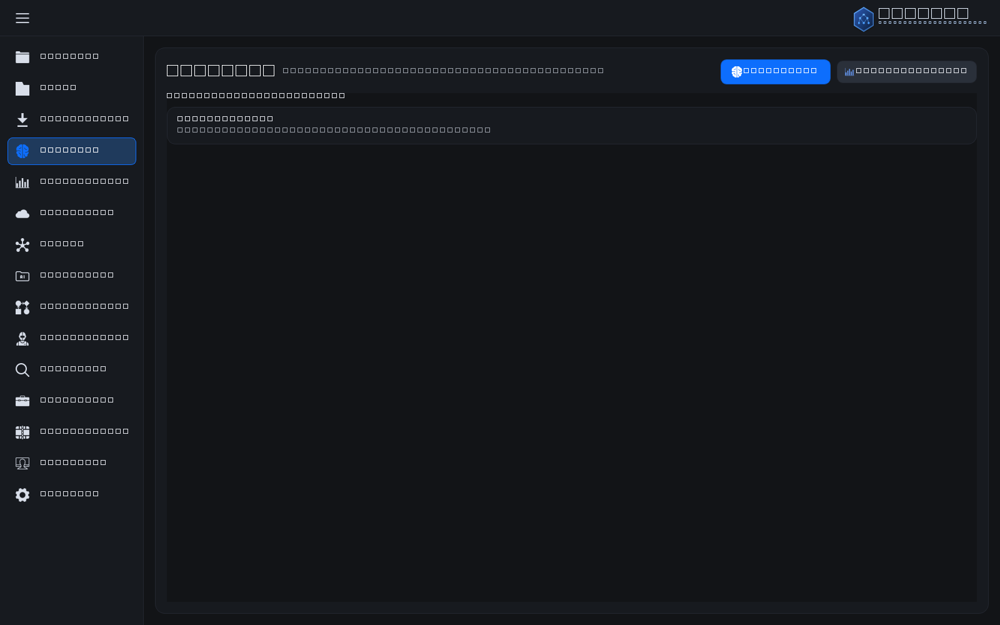

### Scheduled Tasks
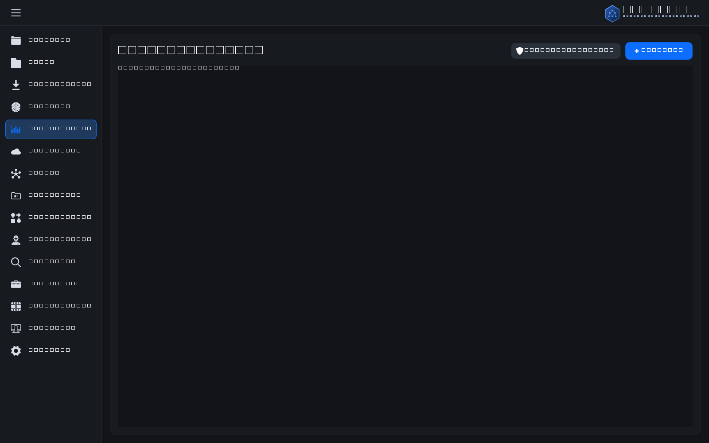

### Cloud Sync
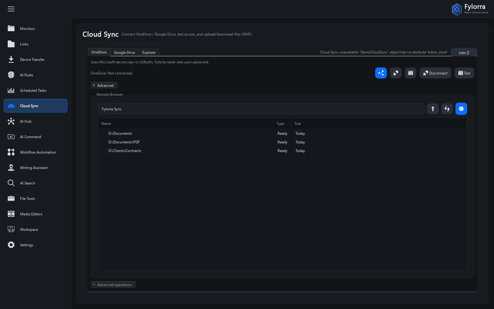

### AI Hub
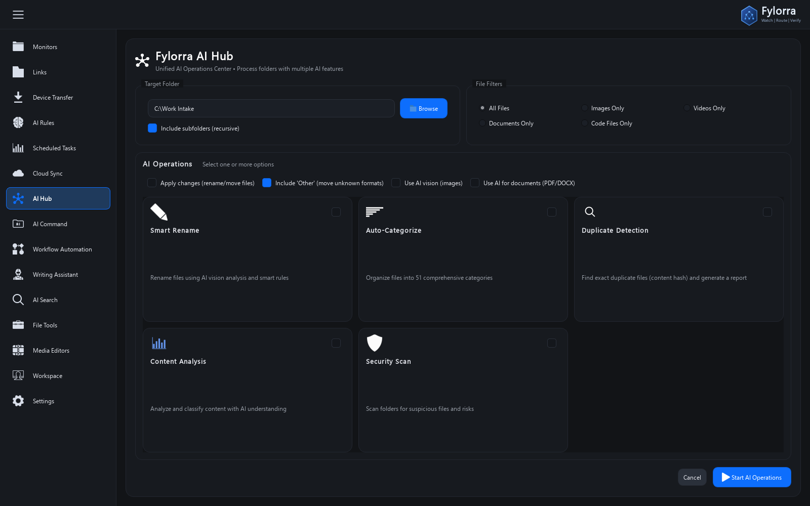

### AI Command
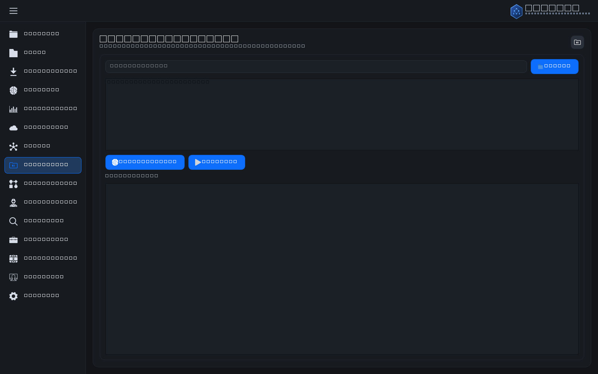

### Workflow Automation
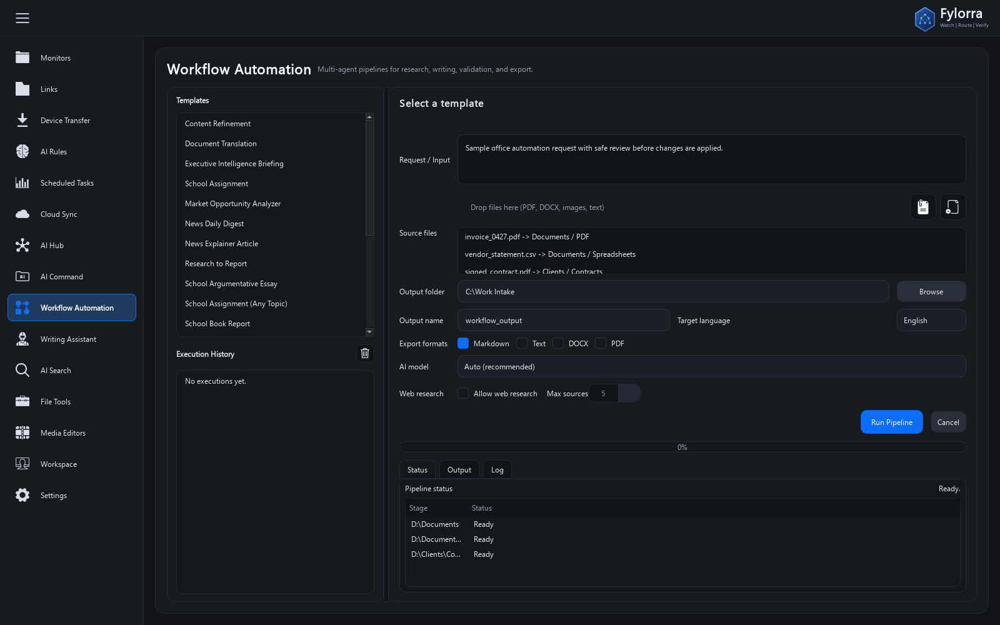

### Writing Assistant
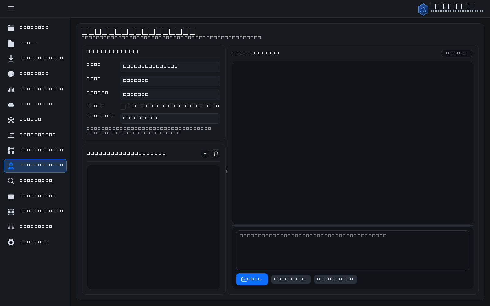

### AI Search
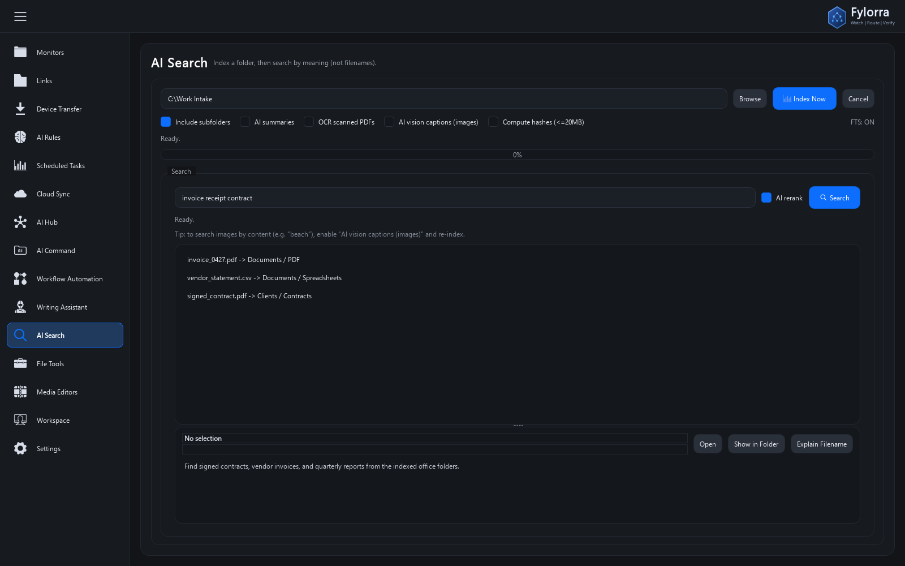

### File Tools
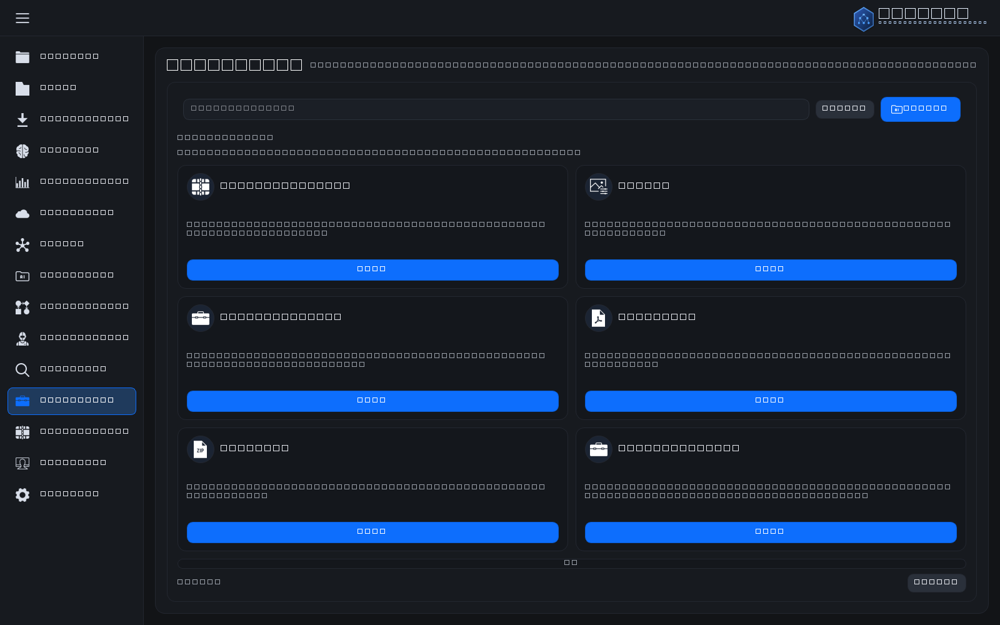

### Media Editors
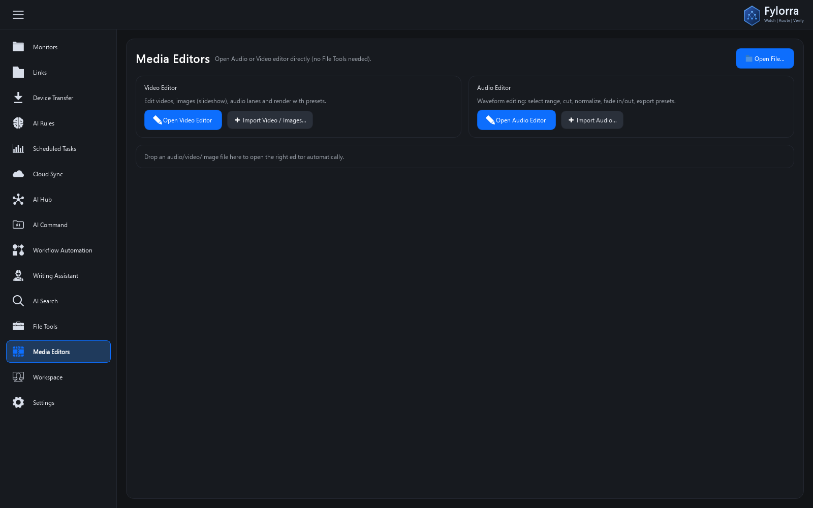

### Workspace
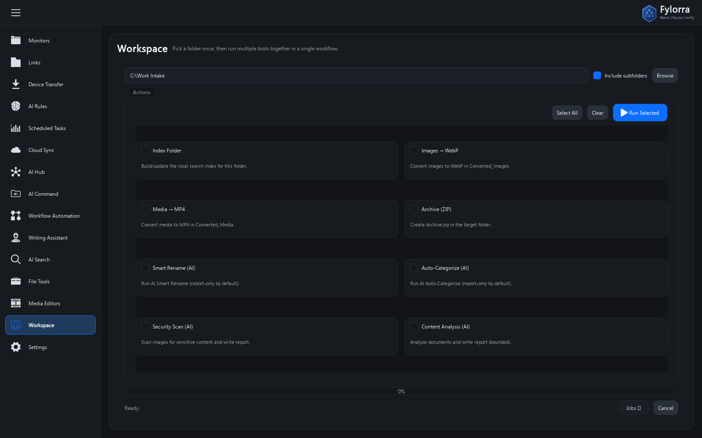

### Settings
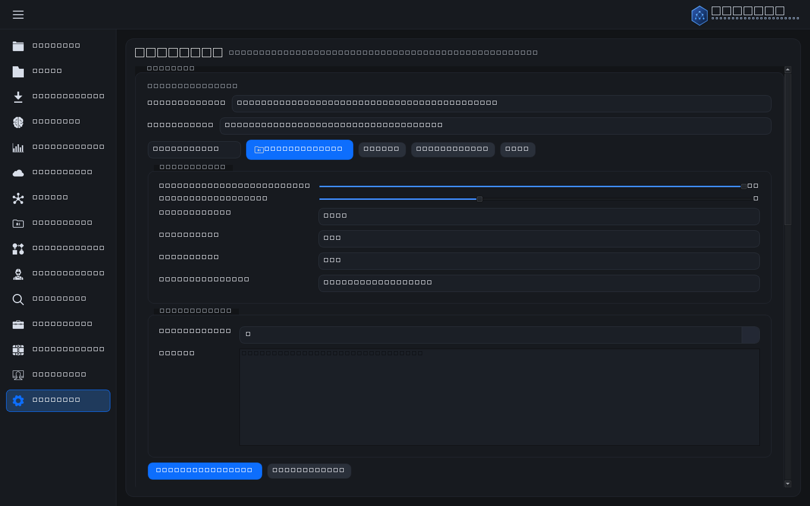

---

## 🚀 Installation

### Prerequisites
- **Python 3.10+** for source runs
- **Windows 10/11, macOS, or Linux**

### Download Binaries

Download the latest release from GitHub Releases. Release builds include:

- Windows x64 installer: `Fylorra-Windows-x64-Setup.exe` (recommended)
- Windows x64 portable: `Fylorra-Windows-x64.zip`
- Linux x64: `Fylorra-Linux-x64.tar.gz`
- macOS Apple Silicon: `Fylorra-macOS-arm64.tar.gz`
- macOS Intel: `Fylorra-macOS-x64.tar.gz`

Development builds are also available from the **Build Binaries** workflow artifacts.

### Install Dependencies

```bash
pip install -r requirements.txt
```

### Optional Tools (Seamless Conversions)

- **Office → PDF** uses LibreOffice headless (`soffice`). You can either install LibreOffice normally, or bundle it with the app under `tools/libreoffice/`.
- **Media conversion** uses `ffmpeg`. You can install it system-wide or bundle it under `tools/ffmpeg/`.
- You can also override paths via env vars:
  - `FYLORRA_SOFFICE` (path to `soffice.exe`)
  - `FYLORRA_FFMPEG` (path to `ffmpeg.exe`)

### Run the Application

```bash
python main_qt.py
```

---

## 📖 Usage Guide

### Adding a Folder Monitor

1. Click **"+ Folder Monitor"** button
2. Browse and select the folder to monitor (local or network UNC path)
3. (Optional) Add automation rules:
   - Choose trigger events (created, modified, deleted, moved)
   - Set file filters (by extension)
   - Select action type and parameters
4. Click **"Add Monitor"**

### Adding an FTP Monitor

1. Click **"+ FTP Monitor"** button
2. Enter FTP server details:
   - Host (e.g., `ftp.example.com`)
   - Port (default: 21)
   - Username and password
   - Remote path to monitor
   - Poll interval (how often to check for changes)
   - Enable TLS/SSL if needed
3. Click **"Test Connection"** to verify settings
4. Click **"Add Monitor"**

**Note:** FTP monitoring uses polling (checks periodically) rather than real-time events.

### Creating Automation Rules

**Example 1: Auto-organize downloads**
- Trigger: `created`
- Extensions: `.pdf, .docx, .xlsx`
- Action: `organize by type`

**Example 2: Backup important files**
- Trigger: `created, modified`
- Extensions: `.docx, .xlsx`
- Action: `copy to D:\Backups`

**Example 3: Archive old files**
- Trigger: `created`
- Action: `archive to archive_{date}.zip`

### System Tray

- Close the window to minimize to system tray
- Right-click tray icon for options
- Double-click to restore window

---

## 🎨 Modern UI Features

### Dashboard
- **Real-time activity feed** for each monitor
- **Statistics tracking**: files created, modified, deleted, actions executed
- **Status indicators**: running/stopped monitors
- **Color-coded events** for easy recognition

### Themes
- **Dark Mode** (default)
- **Light Mode**
- **System Theme** (follows Windows settings)

### Color Schemes
- Blue (default)
- Green
- Dark Blue

---

## ⚙️ Configuration

### Settings Location
Settings are stored in: `C:\Users\[YourName]\.fylorra\`

- `settings.json` - Application settings
- `monitors.json` - Monitor configurations

### Available Settings

```json
{
  "theme": "dark",
  "minimize_to_tray": true,
  "notifications_enabled": true,
  "notification_sound": true,
  "auto_start_monitors": true
}
```

---

## 🔧 Advanced Features

### Pattern Variables for Rename Action
- `{name}` - Original filename
- `{ext}` - File extension
- `{date}` - Current date (YYYYMMDD)
- `{time}` - Current time (HHMMSS)
- `{timestamp}` - Full timestamp

**Example:** `backup_{name}_{date}` → `backup_document_20250115`

### Organize Actions
- **By Extension**: Groups files by file type (.pdf, .docx, etc.)
- **By Date**: Organizes into YYYY/MM folder structure
- **By Type**: Categorizes into Documents, Images, Videos, etc.

### Network Folder Monitoring
Fylorra supports Windows UNC paths for network folders:

**Examples:**
- `\\ServerName\SharedFolder`
- `\\192.168.1.100\Files`
- `\\DESKTOP-PC\Documents`

**Important Notes:**
- Ensure network path is accessible
- Network monitoring may have slight delays compared to local folders
- Credentials must be already authenticated in Windows

### FTP Server Monitoring
FTP monitoring uses polling (periodic checks) instead of real-time events:

**Supported:**
- Standard FTP (port 21)
- FTPS (FTP with TLS/SSL)
- Custom ports

**Limitations:**
- Changes detected based on poll interval (default 30 seconds)
- Only monitors files, not subdirectories (in current version)
- Actions like copy/move work with local destination only

---

## 🛠️ Troubleshooting

### Notifications Not Showing
- Ensure Windows notifications are enabled for Python
- Check notification settings in Fylorra settings
- Verify `winotify` is installed correctly

### Folder Monitor Not Starting
- Verify the folder path exists
- Check folder permissions
- For network paths: ensure path is accessible from File Explorer

### FTP Monitor Not Connecting
- Click "Test Connection" to verify credentials
- Check firewall settings
- Verify FTP server is accessible
- Try increasing poll interval if server is slow

### High CPU Usage
- Reduce number of monitored folders with high activity
- For FTP: increase poll interval
- Add file extension filters to rules
- Disable unused monitors

---

## 📋 System Requirements

- **OS**: Windows 10 or Windows 11
- **Python**: 3.8 or higher
- **RAM**: 100MB minimum
- **Disk**: 50MB for application

---

## 🎯 Use Cases

### For Professionals
- **Download Management**: Auto-organize downloads by type
- **Backup Automation**: Auto-copy work files to backup location
- **Document Processing**: Auto-rename and organize incoming files

### For Developers
- **Build Automation**: Trigger builds on file changes
- **Log Management**: Auto-archive old log files
- **Code Organization**: Auto-organize project files

### For Content Creators
- **Media Organization**: Auto-sort photos/videos by date
- **Project Management**: Auto-backup project files
- **Asset Management**: Organize assets by type

---

## 🔐 Security & Privacy

- **No internet connection required** - fully offline
- **No data collection** - all data stays on your machine
- **Open source** - review the code yourself
- **Local storage only** - settings stored in user profile

---

## 📝 License

This project is open source and available for personal and commercial use.

---

## 🤝 Contributing

Contributions are welcome! Feel free to:
- Report bugs
- Suggest features
- Submit pull requests

---

## 💡 Tips & Best Practices

1. **Start with simple rules** - Test with one rule before adding multiple
2. **Use file filters** - Reduce noise by filtering specific extensions
3. **Test destination paths** - Ensure write permissions before running
4. **Monitor activity feed** - Watch the real-time log to verify rules work
5. **Export logs regularly** - Use "📊 Export Logs" button for backup/analysis
6. **Check console output** - All events are logged to console and log files
7. **Automatic persistence** - Monitors are automatically saved on close

---

## 🎊 What's Next?

Planned features for future releases:
- Email notifications
- FTP/SFTP upload support
- Cloud storage integration (Dropbox, Google Drive)
- Advanced filtering (file size, age, content)
- Scheduled actions
- Web dashboard
- Multi-language support

---

## 📧 Support

For issues and questions:
- Check the documentation
- Review existing GitHub issues
- Create a new issue with details

---

**Made with ❤️ for productive automation**

**Fylorra** - Know where every incoming file goes.
